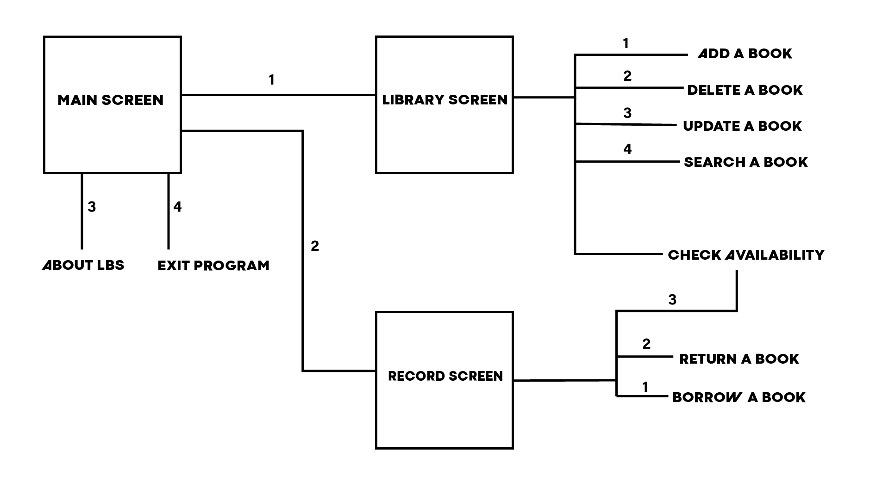

# Introduction

This software helps to keep track of all the books in a school library and the records of students/teachers who borrow books from the library. 

The user can borrow books in the library and save their details like their name, class, the book and the date. Every time a user wants to borrow/return a book it’ll change the availability of the book in the library database. 

The user can search for a book in the database by its name, author’s name and genre. 

This program will contain various more functions we will go through all of them in the documentation. 

